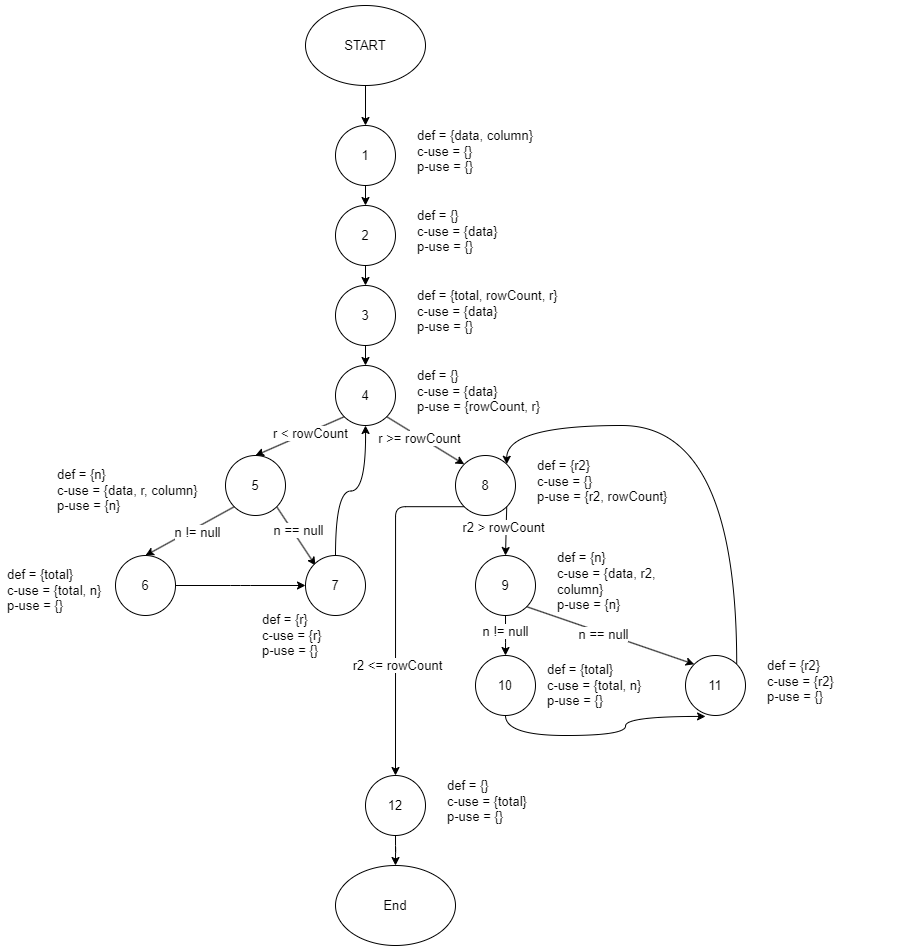

**SENG 637 - Dependability and Reliability of Software Systems**

**Lab. Report #3 – Code Coverage, Adequacy Criteria and Test Case Correlation**

| Group \#:      |     |
| -------------- | --- |
| Student Names: |     |
|                |     |
|                |     |
|                |     |

(Note that some labs require individual reports while others require one report
for each group. Please see each lab document for details.)

# 1 Introduction

Text…

# 2 Manual data-flow coverage calculations for X and Y methods

<!--  -->
##### Defs, uses, and du-pairs

|               |                                |
| ------------- | ------------------------------ |
| **defs**:     | def(1) = {data, column}        |
|               | def(3) = {total, rowCount, r}  |
|               | def(5) = {n}                   |
|               | def(6) = {total}               |
|               | def(7) = {r}                   |
|               | def(8) = {r2}                  |
|               | def(9) = {n}                   |
|               | def(10) = {total}              |
|               | def(11) = {r2}                 |
| **uses**:     | use(2) = {data}      |
|               | use(3) = {data}      |
|               | use(4) = {rowCount, r}      |
|               | use(5) = {data, r, column, n}              |
|               | use(6) = {total, n}              |
|               | use(7) = {r}              |
|               | use(8) = {r2, rowCount}              |
|               | use(9) = {data, r2, column, n}              |
|               | use(10) = {total, n}              |
|               | use(11) = {r2}              |
|               | use(12) = {total}              |
| **du-pairs**: | data: (1, 2), (1, 3), (1, 5), (1, 9) |
|               | column: (1, 5), (1, 9)         |
|               | total: (3, 6), (3, 10), (3, 12), (6, 6), (6, 12), (10, 10), (10, 12)         |
|               | rowCount: (3, 4), (3, 8)        |
|               | r: (3, 4), (3, 5), (3, 7), (7, 7), (7, 4)       |
|               | n: (5, 5), (5, 6), (9, 9), (9, 10)       |
|               | r2: (8, 8), (8, 9), (8, 11), (11, 11), (11, 8) |

### DU-pair coverage calculation per test case
| Variable (v) | Defined at node (n) | dcu(v, n) | dpu(v, n)        |
| -------- | --------------- | --------- | ---------------- |
| data     | 1               | {2, 3, 5} | {(2, 3), (2, ∅)}               |
| data     | 1               | {2, 3, 9} | {(2, 3), (2, ∅)}               |
| column   | 1               | {5}       | {}               |
| column   | 1               | {9}       | {}               |
| r        | 3               | {5, 7}    | {(4, 5), (4, 8)} |
| r        | 7               | {5, 7}    | {(4, 5), (4, 8)} |
| r2        | 8               | {9, 11}    | {(8, 9), (8, 12)} |
| r2        | 11               | {9, 11}    | {(8, 9), (8, 12)} |
| rowCount | 3               | {}        | {(4, 5), (4, 8)} |
| total    | 3               | {6, 12}    | {}               |
| total    | 6               | {6, 12}    | {}               |
| total    | 3               | {10, 12}    | {}               |
| total    | 10               | {10, 12}    | {}               |
| n        | 5               | {6}       | {(5, 6), (5, 7)} |
| n        | 9               | {10}       | {(9, 10), (9, 11)} |
|          | Total           | CU = 26   | PU = 18           |

Now we calculate all-uses coverage using the following equation:

```math
\[\frac{{CU_c + PU_c}}{{(CU + PU) - (CU_f + PU_f)}}\]
```

# 3 A detailed description of the testing strategy for the new unit test

Text…

# 4 A high level description of five selected test cases you have designed using coverage information, and how they have increased code coverage

Text…

# 5 A detailed report of the coverage achieved of each class and method (a screen shot from the code cover results in green and red color would suffice)

Text…

# 6 Pros and Cons of coverage tools used and Metrics you report

Text…

# 7 A comparison on the advantages and disadvantages of requirements-based test generation and coverage-based test generation.

Text…

# 8 A discussion on how the team work/effort was divided and managed

Text…

# 9 Any difficulties encountered, challenges overcome, and lessons learned from performing the lab

Text…

# 10 Comments/feedback on the lab itself

Text…
